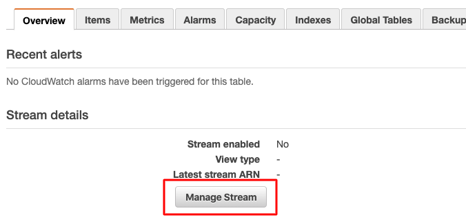
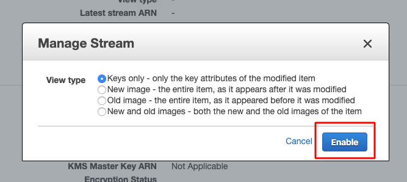

# WhatsApp <> Zendesk Connector

## Read this before anything else!

For this integration to work, you need to have your instance of the **WhatsApp API up and running**.

If you want to understand more about the project you can check out these articles covering its architecture, project decisions and some other general topics:

- Link to article (I'll get to it... someday)

## Project structure

*Explain about the main files in here*

## Getting started

### Install all you'll need

1. If you don't have it already, install the [AWS CLI](https://aws.amazon.com/cli/). The serverless framework will use it to do its magic.

2. Install the [serverless framework CLI](https://serverless.com/) and [configure the AWS credentials](https://serverless.com/framework/docs/providers/aws/cli-reference/config-credentials/) for it.

### Create the resources you'll use

1. `whatsapp_messages` DynamoDB table with the primary key `wa_id` and the sorting key `msg_id`

2. `zendesk_messages` DynamoDB table with primary key `wa_id` and sorting key `commentId`

3. `open_tickets` DynamoDB table with primary key `wa_id` and no sorting key

Once created the tables, you need to enable the Stream for the first two like this:





After creating the streams, copy the **Latest stream ARN**. You'll need for the next step.

4. Create an **AWS S3 bucket** to store the audio files you receive from WhatsApp. It doesn't matter the name of the bucket, but you'll need it on the next step.

5. Optionally, you may create an **AWS IAM Role** with all the permissions your lambdas will need and use it's ARN in the next step.

If you don't want to create the role manually, you can configure the lambda permissions in the `serverless.yml` file as shown in [this article](https://serverless.com/framework/docs/providers/aws/guide/iam/).

### Set your environment variables

Copy the `envvars.dist` file renaming it to `envvars.json` and fill all the values in it. Here's the description of everything you'll need:

```json
{
  "generalRole": "the ARN of the general IAM role you created",
  "zendeskApiBaseUrl": "base URL of your Zendesk API",
  "zendeskUser": "email of the zendesk user you'll use to auth the API",
  "zendeskPwd": "password of the user you'll use to auth the API",
  "zendeskToken": "a Zendesk API token ",
  "whatsappMessagesTable": "the name of the whatsapp_messages table on Dynamo",
  "whatsappMessagesTableStreamArn": "ARN of the Stream you created for the whatsapp_messages",
  "whatsappTicketsTable": "the name of the open_tickets table on Dynamo",
  "commentsFromZendeskTable": "the name of zendesk_messages table on Dynamo",
  "commentsFromZendeskTableStreamArn": "ARN of the Stream you created for the zendesk_messages",
  "whatsappUser": "username for the admin user of your WhatsApp API",
  "whatsappPwd": "password for the admin user of your WhatsApp API",
  "whatsappBaseUrl": "base URL for your WhatsApp API",
  "whatsappMediaBucket": "the name of the bucket you created to store the audio messages"
}
```

### Test!

Make sure the webhooks are working

### First deploy

### Configure the webhook on WhatsApp API

### Configure the webhook on Zendesk

## Testing the functions

There is a directory called *test_data* with many JSON files. Those files can be used as inputs for your lambda functions when testing locally. Simply use the following:

```
serverless invoke local -f <function> -p <path_to_test_file>
```

Where `function` is the name of the function as in the function node on `serverless.yml` file and `path_to_test_file` is the path to the file you want to use as input.

## Deploying the service

Simply run:

```
serverless deploy -s <stage>
```

Where `stage` is the deployment stage you want. The stage is going to be used as a sufix in all functions names.
